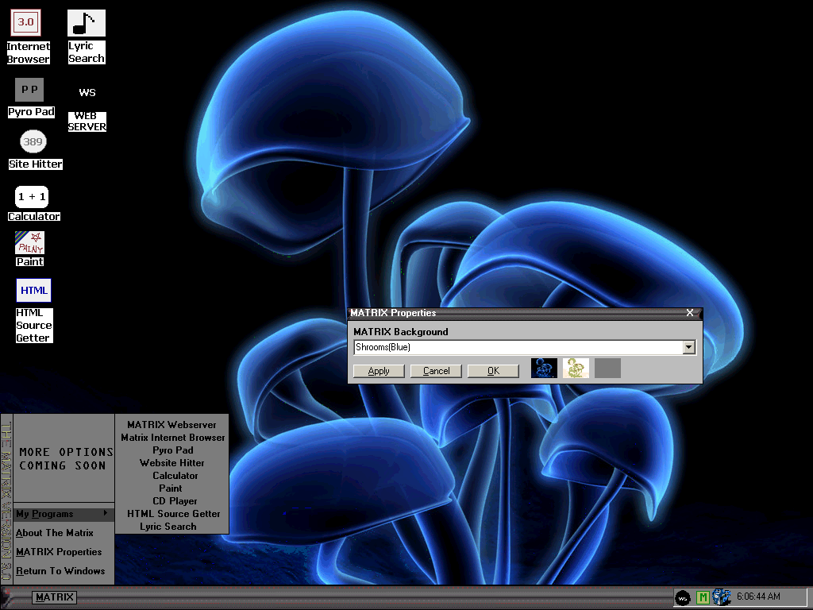



## THE MATRIX 3\.0 \(UPDATED\)

### Description

This is an updated of my first submission of THE MATRIX 3.0! I have changed a few things here and there.... And added a new gui to it! Look at the screenshot! It shows alot... PLEASE RATE MY CODE PEOPLE! I WANA KNOW WHAT YOU THINK!!! EMAIL ME IF YOU WANA HELP ME ON 4.0!
 
### More Info
 

             |
---                |---
**Submitted On**   |2002-11-03 12:50:32
**By**             |[Jesse Seidel \(Dr\. Fire\)](https://github.com/Planet-Source-Code/PSCIndex/blob/master/ByAuthor/jesse-seidel-dr-fire.md)
**Level**          |Advanced
**User Rating**    |4.8 (19 globes from 4 users)
**Compatibility**  |VB 6\.0
**Category**       |[Complete Applications](https://github.com/Planet-Source-Code/PSCIndex/blob/master/ByCategory/complete-applications__1-27.md)
**World**          |[Visual Basic](https://github.com/Planet-Source-Code/PSCIndex/blob/master/ByWorld/visual-basic.md)
**Archive File**   |[THE\_MATRIX1491481132002\.zip](https://github.com/Planet-Source-Code/jesse-seidel-dr-fire-the-matrix-3-0-updated__1-40368/archive/master.zip)

